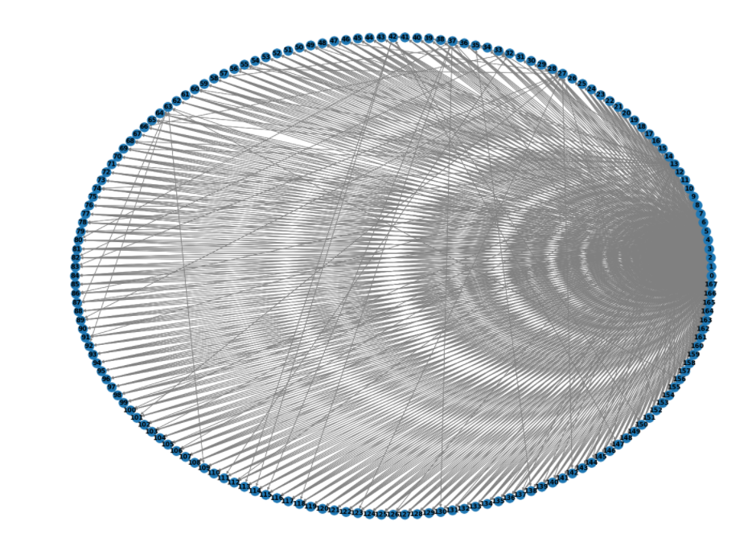
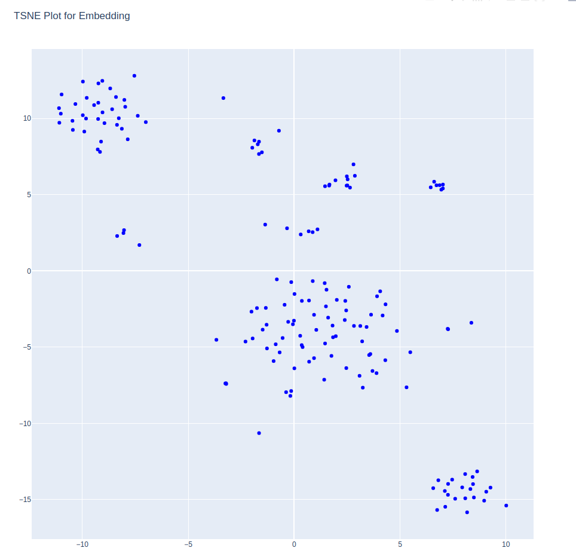

# Summary about the project

<!-- TABLE OF CONTENTS -->

  
Table of Contents

  <ol>
    <li><a href="#overview">overview</a></li>
    <li><a href="#what-is-karate-club?">What is karate club?</a></li>

<!-- Overview -->
# Overview 

This project uses the neo4j graph from the [project](https://github.com/Ganesamanian/Graph-modeling-with-car-crash-attributes). The graph is converted into Embedding based on few perfomance criteria with which the vehicle nodes are been clustered and visualised using TSNE

(<a href="#top">back to top</a>)

<!-- What is karate club? -->
# What is karate club?

Karate Club is an unsupervised machine learning extension library for NetworkX.

Karate Club is an unsupervised machine learning extension library for NetworkX. It builds on other open source linear algebra, machine learning, and graph signal processing libraries such as Numpy, Scipy, Gensim, PyGSP, and Scikit-Learn. Karate Club consists of state-of-the-art methods to do unsupervised learning on graph structured data. To put it simply it is a Swiss Army knife for small-scale graph mining research. First, it provides network embedding techniques at the node and graph level. Second, it includes a variety of overlapping and non-overlapping community detection methods. Implemented methods cover a wide range of network science (NetSci, Complenet), data mining (ICDM, CIKM, KDD), artificial intelligence (AAAI, IJCAI) and machine learning (NeurIPS, ICML, ICLR) conferences, workshops, and pieces from prominent journals.

For installation and further documentation [refer](https://karateclub.readthedocs.io/en/latest/notes/introduction.html)

Directed Graph with nodes and relations from Neo4j

Nodes clustered after converted to embedding using karate club

(<a href="#top">back to top</a>)

